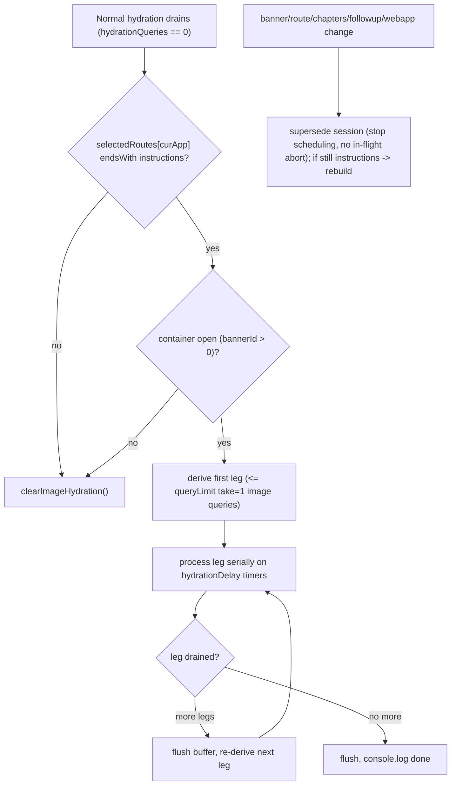

# ImageHydration: serial, take=1, container-scoped image hydration

## Behavior (from decisions)
- Trigger: after normal hydration completes (`hydrationQueries === 0 && !isHydrationSessionBusy()`).
- Gate: current selected route `state.pagination.selectedRoutes[curApp]` ends with `instructions`.
- Scope: route-based — the route prefix picks the parent leg (`filtersinstructions` -> filters, `siftersinstructions` -> sifters, plain `instructions` -> that webapp's instructions legs), scoped to the currently opened container (selected banner + course chapters / quiz followup).
- Fetch: only dehydrated `instructions` (image) rows. Dehydrated-image criteria: `imageurl` is a string that starts with `data:image` (a valid image mime prefix) but is NOT a full data URL (no `;base64,<data>` payload) — i.e. it only contains a valid image mime type. Checked via a new `isDehydratedImage` helper that reuses `isValidDataUrl` from [src/library/imageUtils.ts](src/library/imageUtils.ts).
- Legs (like main hydration): queries are split into legs, each leg capped at `normalizeQueryLimit(settings.queryLimit)` queries; the next leg is re-derived from live state after the current leg drains.
- Execution: within a leg queries run serially (each awaits the previous, concurrency 1 — no staggered concurrency) with `limit.take = 1` (one image per query).
- Timer-driven state updates (like main hydration): each query is dispatched on a `hydrationDelay` timer, and hydrated rows are applied to the store via the shared buffered flush timer (`enqueueHydrationStoreUpdate` / `HYDRATION_STORE_FLUSH_MS`), plus a flush at each leg boundary — no per-item immediate flush.
- Not mid-flight cancellable (matches the images repo, where hydration cannot be cancelled): there is no abort of an in-flight request. Teardown only supersedes the session — it clears the pending (not-yet-dispatched) timer and stops leg derivation. Any already-dispatched query still settles and still applies its result to the store (rows are enqueued/flushed as usual); the key guard only prevents scheduling the NEXT query/leg, it does not discard the settled result.
- Teardown/rebuild on route or parent change only: when the route no longer ends with `instructions`, or the container/parent (banner id, route, chapters/followup, webapp) changes, the current session is superseded; if still on an instructions container, a new session is built for it.
- Progress: reported via `console.log` (no cpanel message) — start, per-leg `[ImageHydration] leg c/total`, per-item `[ImageHydration] i/total`, and completion.
- Supplement: existing `hydrateContainer` / `useHydrateContainer` stays as-is.
- Isolation: an independent queue module with its own state/timers so it never touches the main queue globals or `session.hydrationQueries`.

## Flow

## Changes

### 1. Legged, serial, timer-driven queue manager — new `src/library/imageHydrationQueue.ts`
Mirrors the leg/timer structure of [src/library/hydrationQueue.ts](src/library/hydrationQueue.ts) but with concurrency 1 (serial), take fixed to 1, and fully independent module state so it never mutates the main queue globals or `session.hydrationQueries`. There is no mid-flight cancel — teardown only supersedes the session (matches the images repo, where hydration can't be cancelled).
- Module state: `activeKey: string | null`, `deriveNextLeg: (() => QueryParams[]) | null`, `legQueue: HydrationFetchSpec[]`, `currentLegIndex`, `totalLegs`, `itemsInLeg`, `itemIndex`, `pendingTimeout`, `inFlight: boolean`, `isIncognitoSession`.
- `startImageHydration(dispatch, key, deriveLeg, firstLegQueries, estimatedTotalLegs, isIncognito)`: if `key === activeKey && (inFlight || legQueue.length)` no-op; else reset state, set `activeKey`/deriver/progress, seed `legQueue` from `firstLegQueries`, `console.log('[ImageHydration] start', key, totalLegs)`, kick off the leg runner.
- Leg runner (serial + timer): schedule `pendingTimeout = setTimeout(runNext, hydrationDelay)`; `runNext` guards `key !== activeKey` (superseded → stop, no further scheduling), sets `inFlight`, `await dispatch(deHydratedRowsDataFetcher({ fetcher, hydrationSeekIds, skipQueueLifecycle: true })).unwrap()` (catch per-item, continue). The settled result always updates the store (rows are enqueued/flushed inside the thunk regardless of supersede). After settle, `console.log('[ImageHydration] i/total', ...)`, then re-check `key === activeKey`: if still current, schedule the next item on another `hydrationDelay` timer; if superseded, stop (do not schedule further, but the just-applied state stands).
- Leg boundary: when `legQueue` empties, `flushHydrationStoreBuffer()`, call `deriveNextLeg()`; if it returns queries → `currentLegIndex++`, `console.log('[ImageHydration] leg c/total')`, refill `legQueue` (mapped to fetch specs), continue; else `flushHydrationStoreBuffer()`, `console.log('[ImageHydration] done')`, reset.
- Store writes go through the shared buffered flush timer via `enqueueHydrationStoreUpdate` (inside `deHydratedRowsDataFetcher`), i.e. timer-based like main hydration; explicit `flushHydrationStoreBuffer()` only at leg boundaries / completion.
- `supersedeImageHydration()` (invoked by the hook on route/parent change and unmount): `clearTimeout(pendingTimeout)` (drops the pending, not-yet-dispatched query), `legQueue = []`, `deriveNextLeg = null`, `activeKey = null`, `flushHydrationStoreBuffer()`. It does NOT abort an already-dispatched in-flight request; that request settles and STILL applies its result to the store (the `key !== activeKey` guard only stops scheduling the next query/leg). Do not `resetHydrationStoreBuffer()` here — never drop already-fetched rows.
- Exports `getImageHydrationKey()` and `isImageHydrationBusy()` for the hook.
- `HydrationFetchSpec` type reused from / shared with [src/library/hydrationQueue.ts](src/library/hydrationQueue.ts).

### 2. Skip normal-queue lifecycle for serial fetches — [src/library/Thunks.ts](src/library/Thunks.ts)
- Extend `DehydratedRowsFetchArg` with optional `skipQueueLifecycle?: boolean`.
- In the `finally` of `deHydratedRowsDataFetcher`, only call `onHydrationQueryComplete` / `onHydrationSessionIdle` when `!skipQueueLifecycle` (serialization is driven by awaiting `.unwrap()`), keeping the shared `enqueueHydrationStoreUpdate` path intact.

### 3. Scoped instructions query builder — new `src/library/imageHydrationUtils.ts`
- `getInstructionsParentFromRoute(route)`: returns `'filters' | 'sifters' | 'all' | null` (null when it does not end with `instructions`).
- `isDehydratedImage(item)`: `typeof item.imageurl === 'string' && item.imageurl.startsWith('data:image') && !isValidDataUrl(item.imageurl)` — true when the value is a bare image mime type (e.g. `data:image`, `data:image/jpeg`) with no base64 payload. Reuses `isValidDataUrl` from [src/library/imageUtils.ts](src/library/imageUtils.ts).
- `buildContainerInstructionsQueries(state, webapp, bannerId, chapters, followupId, routeParent)`:
  - Resolve the opened container's descendant filter/sifter ids from the selected banner's `pennants` (and course chapters / quiz followup), then build a scoped image-dehydrated predicate `isDehydratedImage(row) && instructionBelongsToContainer(row)`.
  - Call only the instructions getters from [src/library/hydrationUtils.ts](src/library/hydrationUtils.ts) (`getFiltersInstructions` / `getSiftersInstructions`) per `routeParent`, passing the container-scoped image predicate as the discriminator.
  - Run results through `getFixedSizeQueries(queries, 1)` to force `take = 1` / one image per query. Returns `QueryParams[]`.
- `createImageHydrationLegDeriver(getState, webapp, bannerId, chapters, followupId, routeParent)`: mirrors `createHydrationLegDeriver` in [src/library/hydrationUtils.ts](src/library/hydrationUtils.ts) — `maxQueriesPerLeg = normalizeQueryLimit(getState().settings.queryLimit)` (reuse `resolveHydrationSessionOptions`), and each `deriveNextLeg()` rebuilds `buildContainerInstructionsQueries(...)` from live state and returns `takeFirstLegQueries(ordered, maxQueriesPerLeg)`. Leg count estimated via `estimateLegCount`.
- Fetch specs (`authenticatedFetch` vs `anonymousFetch` by `session.isIncognito`) are produced the same way as `toFetchSpecs` in the queue.

### 4. Driver hook — new `src/Hooks/useImageHydration.ts`
- Signature mirrors `useHydrateContainer(webapp, bannerId, enabled)` plus reads route/chapters/followup via selectors.
- Selects `hydrationQueries`, `selectedRoutes[curApp]`, selected banner id, `course.chapters`, `quiz.followupId`.
- Effect keyed on `[webapp, bannerId, route, chapters, followupId, hydrationQueries, enabled]`:
  - Compute `key = ${webapp}:${bannerId}:${route}:${chapters.join(',')}:${followupId ?? ''}`.
  - If `!enabled || bannerId <= 0 || !endsWith('instructions')` -> `supersedeImageHydration()`.
  - Else if the key changed (route/parent change) while a session is active -> `supersedeImageHydration()` first, then start the new one.
  - Else if `hydrationQueries === 0 && !isHydrationSessionBusy() && key !== getImageHydrationKey()` -> build the leg deriver, derive the first leg + estimate leg count, and `startImageHydration(dispatch, key, deriveNextLeg, firstLegQueries, estimatedTotalLegs, isIncognito)`.
  - Cleanup: `supersedeImageHydration()` on unmount.

### 5. Wire into read-only routes (supplement existing hydrate)
- Add `useImageHydration('tutorial', bannerId, selectedBannerIndex > -1 && !noTutorials)` next to the existing `useHydrateContainer` in [src/routes/TutorialReadOnly.tsx](src/routes/TutorialReadOnly.tsx), and likewise in [src/routes/CourseReadOnly.tsx](src/routes/CourseReadOnly.tsx) and [src/routes/QuizReadOnly.tsx](src/routes/QuizReadOnly.tsx).

### 6. Fix main hydration to not drop settled in-flight results — [src/library/hydrationQueue.ts](src/library/hydrationQueue.ts)
- Same principle applied to the main queue: when a session is cancelled/reset (`clearHydrationQueue`, or `resetHydrationQueueState` on a new `startHydrationSession`), an already-dispatched `deHydratedRowsDataFetcher` that later settles must still write its rows to the store.
- Today `resetHydrationQueueState()` calls `resetHydrationStoreBuffer()` (see [src/library/hydrationPayloadBuffer.ts](src/library/hydrationPayloadBuffer.ts)), which can discard buffered rows from an in-flight request that settles across a cancel/new-session boundary.
- Fix: `flushHydrationStoreBuffer()` (apply) instead of `resetHydrationStoreBuffer()` (discard) on cancel/reset, and ensure the post-settle path in `onHydrationQueryComplete` for the `hydrationCancelled` branch does not drop the enqueued update. Verify no double-apply.

## Notes / assumptions
- Reuses `deHydratedRowsDataFetcher` (store-merge via `enqueueHydrationStoreUpdate`) so hydrated images flow through the existing apply path; `skipQueueLifecycle` prevents interference with the normal queue.
- Legs/timers mirror main hydration (`splitQueriesIntoLegs` / `takeFirstLegQueries` / `estimateLegCount`, `hydrationDelay` timers) but run in an independent module (concurrency 1, take=1).
- No mid-flight cancel (images repo hydration can't be cancelled): teardown = supersede (stop scheduling + drop pending timer); an in-flight request still settles and still updates the store — the key guard only stops scheduling the next query/leg. Supersede fires only on route/parent change and unmount.
- Same "don't drop settled in-flight results" fix is applied to main hydration (Change 6).
- "Updates state on a timer" = hydrated rows land via the shared buffered flush (`HYDRATION_STORE_FLUSH_MS`) plus per-query `hydrationDelay` dispatch pacing; the image queue does not touch `session.hydrationQueries`.
- Route-based parent: suffix `instructions` stripped -> prefix `filters`/`sifters` selects the leg; plain `instructions` falls back to all instructions legs for the webapp.
- Progress is surfaced only via `console.log` (`[ImageHydration] ...` start / leg c-of-total / i-of-total / done), not the cpanel message.
- Dehydrated-image criteria (per user): an `imageurl` that only contains a valid image mime type (mime present, base64 data absent) — the skeleton placeholder value is `data:image` (see `defaultContent` in [src/library/controlPanelUtilz.ts](src/library/controlPanelUtilz.ts)).